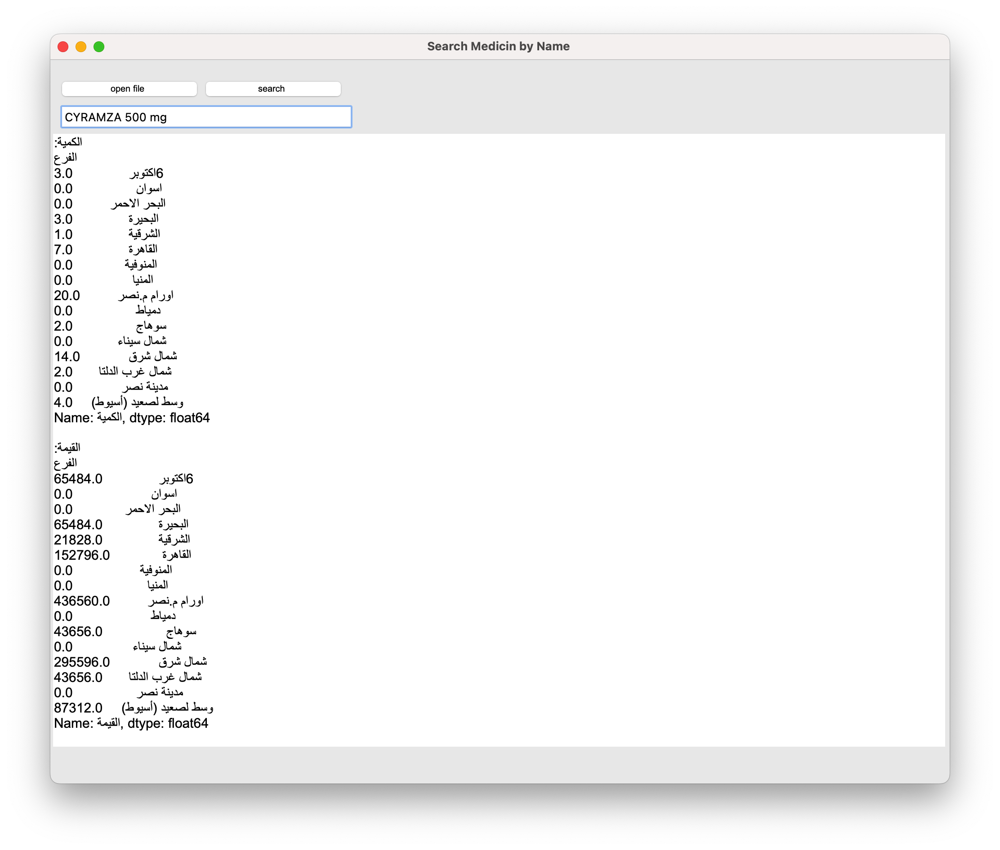

# 💊 Search Medicine by Name

A Python desktop application that allows users to search for medicine information by name using a searchable dataset provided by the Egyptian Health Insurance Organization.

---

## 🧠 Project Idea

This project helps users quickly find information about medicines by entering their names. The program reads and analyzes a dataset containing medicine details and displays the matching results using a simple graphical interface.

---

## 🛠️ Tools & Technologies Used

- **Python** – Core language used for logic and data processing  
- **pandas** – For reading, cleaning, and analyzing the dataset  
- **tkinter** – For creating the GUI interface  
- **PyCharm** – Development environment  
- **Excel/CSV/Text** – The dataset can be in any common tabular format (e.g., `.csv`, `.xlsx`, `.txt`)

---

## 📂 Data Source

- **Provided by**: Egyptian Health Insurance Organization  
- **Contains**: Medicine name, price, company, concentration, and other useful fields.

---

## 🚀 Features

1. Load and read medicine data from Excel, CSV, or text file.
2. Clean and preprocess the data using pandas.
3. User-friendly GUI to:
   - Enter a medicine name
   - View matching results instantly
4. Display full medicine details: name, price, manufacturer, etc.

---

## 🖥️ How to Run

```bash
# Run the script
python search_medicine_gui.py
```

- A GUI window will appear
- Type a medicine name in the input field
- Results will be shown in the app window

---

## 📈 Example Screenshot

Here’s how the app looks:



---

## 📎 Data License

The data is sourced from publicly available documents from the Egyptian Health Insurance Authority.  
*(No direct data file included in this repo)*

---

## 📬 Contact

For questions, suggestions, or collaborations:  
- 💼 LinkedIn: www.linkedin.com/in/abdulrahman-mangoud-408ab21a5
- 💻 GitHub: https://github.com/mangoud2005
